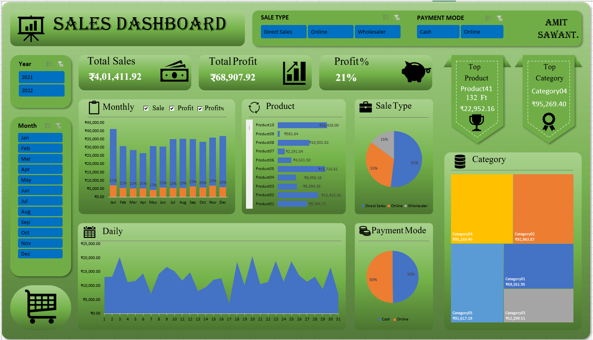

# 📊 Sales Dashboard – Excel Based
An interactive Excel dashboard to track and analyze salesman performance against sales targets, featuring pivot tables, slicers, and visual KPIs for data-driven decision-making.

## 📌 Overview
This Excel-based dashboard analyzes and visualizes sales data to monitor salesman performance against sales targets.  
It provides clear KPIs, interactive filters, and visual charts to help track performance by **salesman, product category, sale type, and payment mode**.

---

## ✨ Features
- **Target vs Achievement** analysis
- **Sales breakdown** by:
  - Salesman
  - Product Category
  - Sale Type (Direct, Online, Wholesaler)
  - Payment Mode (Cash, Online)
- **Interactive slicers** for dynamic filtering
- **Pivot Tables & Charts** for data analysis
- Clean, visually appealing layout

---

## 🖼️ Dashboard Preview
  

---

## 📂 File Structure
- `Sales-Dashboard.xlsx` → Main Excel dashboard
  - **Input Data**: Raw sales transactions
  - **Master Data**: Product details
  - **DataAnalysis**: Pivot table calculations & summaries
  - **Dashboard**: Interactive charts and KPIs

---

## 🛠 Tools & Technologies
- Microsoft Excel
- Pivot Tables
- Slicers
- Conditional Formatting
- Formulas (SUM, IF,VLOOKUP etc.)

---

## 📌 How to Use
1. Download or clone this repository.
2. Open the file `Sales-Dashboard.xlsx`.
3. Use slicers to filter data by product, category, salesman, or month.
4. Review KPIs and charts to analyze performance.

---

## 📊 Insights Example
- Best-performing month in sales revenue
- Most profitable product category
- Top payment mode by revenue share
- Contribution of each sale type to total sales

---

## 👨‍💻 Author
**Amit Sawant**  
📧 [amitsawant3892@gmail.com]  
🔗 [www.linkedin.com/in/amit-sawant-a96125272]

---
